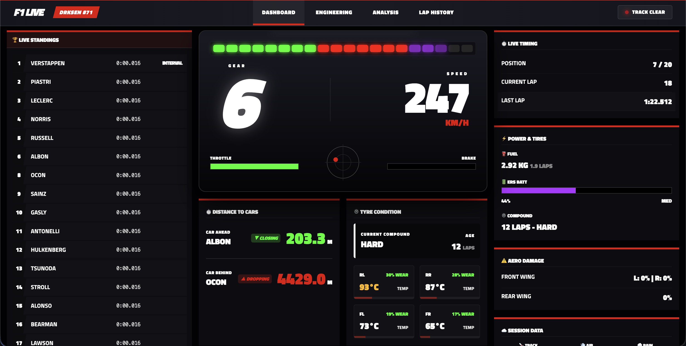
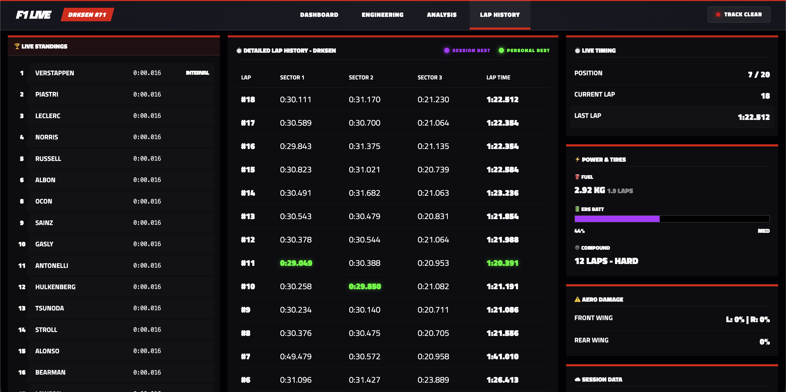
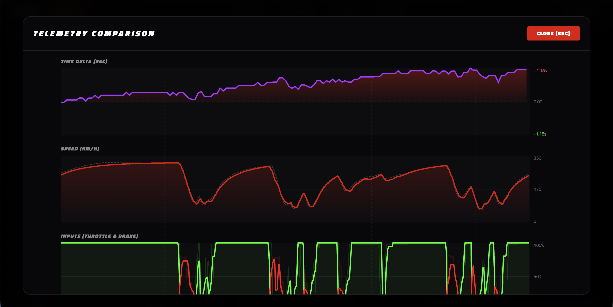

# F1 Telemetry Dashboard 🏎️💨

<div align="center">
  
  
  
</div>

This project is a high-performance, real-time telemetry dashboard for Codemasters' Formula 1 games (F1 23, F1 24, F1 25). It captures binary UDP telemetry packets from your PC or Console and broadcasts them via Socket.io to a modern React-based web interface.

It also includes a **Race Engineer AI Chat** powered by OpenRouter (or OpenAI), which reads your live telemetry and answers strategy questions by voice or text — pit timing, tyre selection, performance analysis, and more.

## 🚀 Features

- **🏆 Live Standings**: Real-time leaderboard with interval tracking and position changes.
- **⏱️ Advanced Timing & Lap History**:
  - Detailed sector-by-sector breakdown.
  - Visual highlighting: <span style="color: #b131ff">**Purple**</span> for Session Best, <span style="color: #00ff00">**Green**</span> for Personal Best.
- **🛞 Tyre Condition & Thermals**:
  - Real-time wear percentage with dynamic color coding (Green -> Yellow -> Red).
  - Surface temperature monitoring for all four tires.
  - Visual compound identification (Soft, Medium, Hard, Inter, Wet).
- **📊 Performance Analysis**: Live telemetry comparison (Speed, Throttle, Brake) with delta tracking against your best lap or other drivers.
- **🏎️ Engineering HUD**:
  - High-fidelity RPM bar with shift indicators.
  - Brake temperature gauges (Optimal: 400°C - 800°C).
  - Core engine thermal monitoring.
  - G-Force radar and input telemetry (Throttle/Brake).
- **⚡ Energy Management**: ERS deployment modes and battery status, plus precise fuel remaining calculation.
- **🤖 Race Engineer AI Chat**:
  - Ask strategy questions by voice (push-to-talk with `Space`) or text.
  - The AI receives your full live telemetry: position, tyres, fuel, damage, lap history, all opponents' compounds and gaps, and weather forecast.
  - Text-to-speech reads responses aloud using Google voices.
  - Supports English and Spanish (language-aware STT, TTS, and AI responses).
  - Switch between **OpenRouter** (free models available) and **OpenAI** (GPT-4o mini).

---

## 🛠️ Prerequisites

- **Node.js** (v18 or higher)
- **F1 23, F1 24, or F1 25** installed on Xbox, PlayStation, or PC.
- Both devices (PC running the dashboard and the Game Console/PC) must be on the **same local network**.
- An **OpenRouter** account for the AI Race Engineer feature (free tier available).

---

## 🤖 AI Race Engineer Setup

The AI chat requires an API key from at least one provider.

### OpenRouter (recommended — free models available)

1. Create a free account at [openrouter.ai](https://openrouter.ai).
2. Go to **Keys** → **Create Key** and copy your key (starts with `sk-or-`).
3. The default model is `google/gemini-2.0-flash-001`.
4. Browse all available models at [openrouter.ai/models](https://openrouter.ai/models).

### OpenAI (optional)

1. Create an account at [platform.openai.com](https://platform.openai.com).
2. Go to **API Keys** and create a new key.
3. The default model is `gpt-4o-mini`.

### Configure your keys

Create `server/.env` (copy from `server/.env.example`):

```env
OPENROUTER_API_KEY=sk-or-your-key-here
OPENAI_API_KEY=sk-your-key-here   # optional
PORT=3000
```

> **Note:** The `.env` file is gitignored and will never be committed. Never share your API keys.

---

## 🎮 Game Configuration (Xbox/PS/PC)

For the game to send data to the dashboard, you must configure UDP telemetry:

1. Launch the F1 game and go to **Settings** > **Telemetry Settings**.
2. **UDP Telemetry**: Set to `On`.
3. **UDP Port**: Set to `20777`.
4. **UDP Format**: **Set to `2023`** (Most stable format for third-party tools).
5. **UDP Send Rate**: Recommended `20Hz` or `30Hz`.
6. **UDP IP Address**: Enter your **PC's local IP address** (e.g., `192.168.1.15`).
   - _Tip (Windows): Find your IP by typing `ipconfig` in the terminal._
   - _Tip (macOS): Find your IP by typing `ipconfig getifaddr en0` in the terminal._

---

## 💻 How to Run the Dashboard

### 1. Installation

Install dependencies in all folders (root, client, and server):

```bash
# From the root directory
npm install
cd server && npm install
cd ../client && npm install
```

### 2. Configure your API keys

```bash
cp server/.env.example server/.env
# Then edit server/.env and paste your OpenRouter key
```

### 3. Start Everything (Single Command)

Start both the backend and the frontend with one command from the root:

```bash
npm run dev
```

The dashboard will be available at `http://localhost:5173`.

---

## 🧪 Testing without the game (Simulator Mode)

If you don't have the console handy:

1. Start the main system (`npm run dev`).
2. In a new terminal, run the simulator:
   ```bash
   cd server && npm run mock
   ```
3. The dashboard will show mock data for Max Verstappen and other drivers simulating a race.

---

## 🎥 Telemetry Recording & Playback

The dashboard supports recording real sessions from your game and playing them back later. This is extremely useful for developing features or analyzing your driving without needing the game running.

### 🔴 Recording Telemetry
By default, recording is disabled to save CPU and disk space. To start the system with telemetry recording enabled, use:
```bash
npm run dev:record
```
This will automatically record all incoming live UDP packets continuously into `server/telemetry_recording.jsonl` (cleared/re-created each time the recording starts).

*Note: You can also enable recording by starting the backend with the `--record` flag or by setting the environment variable `RECORD_TELEMETRY=true`.*

### 🟢 Playback Recorded Telemetry
To play back your recorded session and stream it live to the React dashboard:
1. Ensure the main system is running (without or with recording):
   ```bash
   npm run dev
   ```
2. Start the playback:
   ```bash
   # From the root directory:
   npm run playback

   # Or from the server directory:
   cd server && npm run playback
   ```
This will loop your last recorded session indefinitely in real-time.

#### Playback Options
You can configure the playback speed or play a specific file using arguments (only available when running from the `server` directory):
- `--no-loop`: Stop playback after the session ends instead of looping.
- `--speed=X`: Change playback speed (e.g., `--speed=2.0` for 2x speed, `--speed=0.5` for half speed).
- `--file=path/to/file.jsonl`: Play back a custom recording file.

Example:
```bash
cd server && npm run playback -- --speed=2.0 --no-loop
```

### 🔄 Re-recording / Resetting a Session
If your previous recording was captured with an older or incorrect UDP packet format (e.g., prior to F1 24 custom parser patches), or you simply want to start over:
1. Delete the existing recording file (e.g., `server/telemetry_recording.jsonl`).
2. Start the main dashboard server with recording enabled:
   ```bash
   npm run dev:record
   ```
3. Enter the track on your game. A fresh, properly formatted F1 24 recording will be generated automatically.

---

## 🏗️ Architecture

- **Backend (Node.js)**: Uses `@racehub-io/f1-telemetry-client` to parse UDP data. Exposes a `/api/chat` endpoint that proxies requests to OpenRouter or OpenAI with full telemetry context.
- **Frontend (React + Vite + TypeScript)**: Features a high-fidelity F1 TV Broadcast aesthetic with professional telemetry visuals.
- **Communication**: Real-time bi-directional communication via **Socket.io**.
